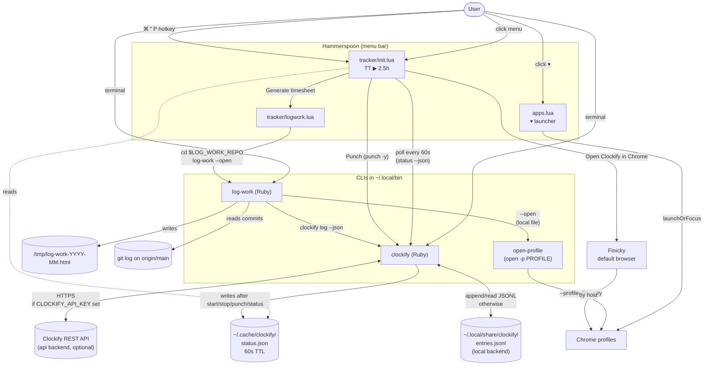

# cli

A small monorepo of CLI tools and Hammerspoon menu-bar widgets. Each
subdirectory is self-contained — edit in place, no build step. Executables
get symlinked onto `$PATH` via `~/.local/bin`; Lua modules get symlinked
into `~/.hammerspoon/`.

If you're setting this up on a new machine, start with [SETUP.md](./SETUP.md).
If you're using Claude Code to help, the top-level [CLAUDE.md](./CLAUDE.md)
gives it the context it needs to wire everything up for you.

## What's in here

### [`clockify/`](./clockify/)

Ruby CLI for time tracking. Stdlib only, single file. Two interchangeable
backends: the [Clockify](https://clockify.me) REST API (when
`CLOCKIFY_API_KEY` is set) or a local-only JSONL log (when it isn't).
Same commands, same JSON output — `log-work` and the Hammerspoon widget
work identically against either backend. Clock in/out (`start`, `stop`,
`punch`), report hours (`log`, with `--json`), and a cached `status`
subcommand designed to be polled by a menu bar widget.

### [`log-work/`](./log-work/)

Ruby CLI that builds a month-shaped HTML timesheet from `git log` + Clockify
hours. Outputs a 31-row editable table with per-row Copy buttons that paste
cleanly into Google Sheets (or wherever your hours go). `--json` mode for
LLM consumers.

### [`hammerspoon/`](./hammerspoon/)

Two [Hammerspoon](https://www.hammerspoon.org/) menu bar widgets:
- `apps.lua` — `▾` dropdown launcher pairing with Hidden Bar to reclaim
  menu bar real estate.
- `tracker/` — Clockify status + Log Work runner. Menubar shows today's
  hour total; dropdown exposes Punch / Refresh / Open / Generate timesheet.

### [`finicky/`](./finicky/)

[Finicky](https://github.com/johnste/finicky) v4 config. Set Finicky as
your default browser to route URLs to specific Chrome profiles by host.

### [`open-profile/`](./open-profile/)

`open` — drop-in wrapper around macOS `open(1)` that adds a `-p PROFILE`
flag for forcing a specific Chrome profile. Used by `log-work --open` so
the local HTML report lands in the right profile (Finicky only routes
http/https URLs, not local files).

## How it fits together

A few things worth noting:

- **The status cache (`~/.cache/clockify/status.json`) is the hub.** The
  Hammerspoon tracker reads it directly — no shell-out, so menu opens are
  instant. The `clockify` CLI writes it on every `start`/`stop`/`punch`/
  `status` so the bar updates immediately after a CLI toggle.
- **`log-work` shells out to `clockify`.** That `--json` contract is the
  single cross-tool dependency.
- **`clockify` itself has two interchangeable backends.** Set
  `CLOCKIFY_API_KEY` to sync with Clockify's web/mobile apps, or leave it
  unset to keep everything in a local JSONL log. Same commands, same
  output shape — log-work and the Hammerspoon widget don't notice.
- **Two paths to Chrome.** Real URLs go through Finicky (routes by host);
  local files like the `log-work` HTML go through `open-profile` because
  Finicky only handles http/https.

## Conventions

- **Edit in place.** Symlinks resolve to the live file — no rebuild step.
- **Stdlib only** for Ruby CLIs. No Gemfile, no bundler — runs against
  system Ruby.
- **One concern per directory.** A Hammerspoon module that's specific to a
  CLI lives with that CLI, not in `hammerspoon/`.
- **Install pattern.** Executables symlink to `~/.local/bin/<name>`; Lua
  modules symlink to `~/.hammerspoon/<name>.lua` (or directory) and are
  `require`d from `~/.hammerspoon/init.lua`.

See each subdirectory's `README.md` for install steps, config, and usage.
